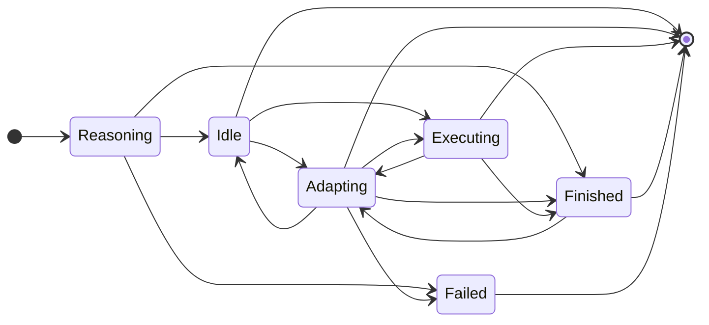

# PlExA

Plan Executor and Adaptor (PlExA) is a library that provides a generic interface to execute plans. It is designed to be used in conjunction with [oRatio](https://github.com/ratioSolver/oRatio).

The following figure shows the possible state transitions of PlExA.

